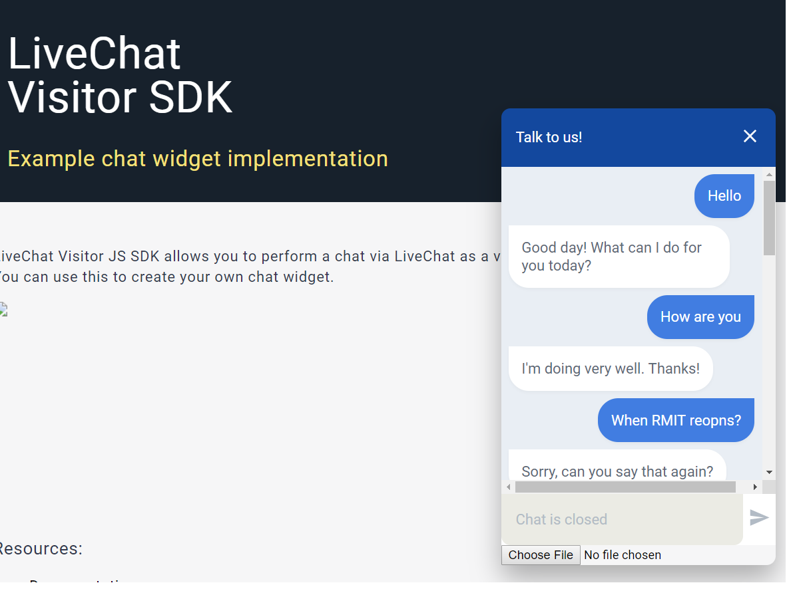
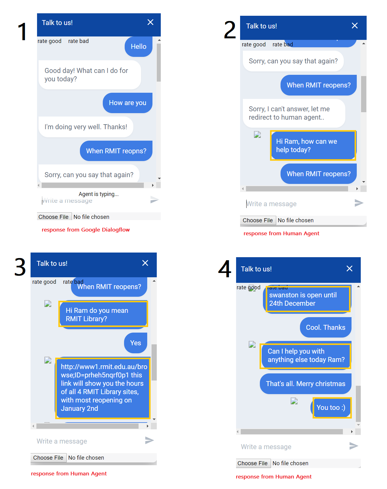

# LiveChatDialogFlowIntegration
LiveChatDialogFlowIntegration

# Steps to run 
  - Update Live Chat License in client.js file which is located inside folder public
  - Update Google Dialogflow Client Access token in client.js file which is located inside folder public
  - In Command prompt - run following command 
    ```sh
    npm install
    npm start
    ```
 - You can see following in the terminal
     ```sh
    > livchat-sample-visitor-chat-widget@0.0.1 start D:\LiveChatDialogFlowIntegration
    > node server.js
    Your app is listening on port 64129
    ```
- In browser, go to http://localhost:64129 (port no from above output)
- Below are the screenshots




